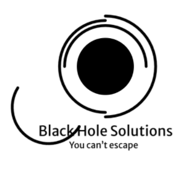

# DSGN 270 Assignment 3 - SVG Logo Design
## By: Edgar Caballero

<br>

Inspiration from:
 <a href="https://codepen.io/jjperezaguinaga/pen/DZxRmb" target="_blank"> SVG Animation by Jose Aguinaga  </a>

<br>

### Troubleshooting:

Used an animation to make the <strong> "outer rings" </strong> of the svg 
rotate around the inner circle.

```
@keyframes rotation-right {
  from {
    transform:  rotate(0deg);
  }
  to {
    transform:  rotate(360deg);
  }
}
```


 - Could not figure out why the “item” would revolve around a different point in the screen.

<br>
This video helped me figure out that the svg group had to revolve around something or else it would just find its own.
<a href="https://www.youtube.com/watch?v=NKlHQCq0gRo" target="_blank"> Image Rotate Animations using CSS Keyframes  </a>

 - The `transform-origin: center` command would let the svg group revolve around the “center” of the svg. So the logo had to be at the absolute center of the svg or else it would move in a way that was not intended for this purpose

 - Changed the code to this (from <a href="https://developer.mozilla.org/en-US/docs/Web/CSS/transform-origin" target="_blank"> transform-origin from mdn web docs </a>):  

```
@keyframes rotation-right {
  from {
    transform-origin: center;
    transform:  rotate(0deg);
  }
  to {
    transform-origin: center;
    transform:  rotate(360deg);
  }
}
```# TSEidolon-dsgn270-a3
